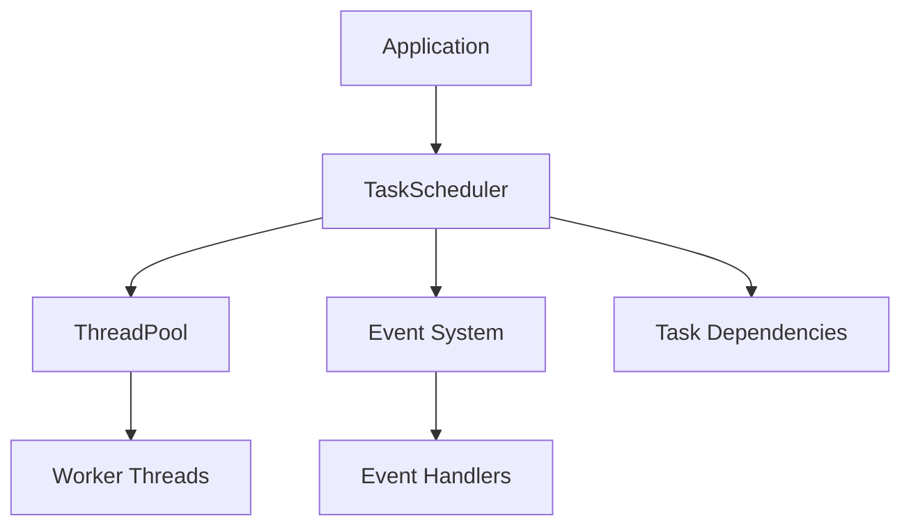

# Threading Framework

The RebelCAD Threading Framework provides a robust, efficient, and easy-to-use system for managing concurrent operations. It consists of two main components: ThreadPool and TaskScheduler.

## Architecture Overview



## Components

### ThreadPool

The ThreadPool manages a collection of worker threads that execute submitted tasks. It provides:

- Priority-based task execution
- Thread-safe task queue
- Automatic thread management
- Exception handling and event emission
- Task completion tracking

```cpp
// Example: Using ThreadPool
ThreadPool pool(4); // Create pool with 4 threads
auto future = pool.submit(1, []() {
    // Task implementation
});
```

### TaskScheduler

The TaskScheduler builds on top of the ThreadPool to provide:

- Task dependency management
- Task state tracking
- Event-based task lifecycle monitoring
- Concurrent task execution
- Priority scheduling

```cpp
// Example: Using TaskScheduler
TaskScheduler scheduler;

// Create tasks with dependencies
auto task1 = scheduler.scheduleTask("task1", []() {
    // Task 1 implementation
});

auto task2 = scheduler.scheduleTask("task2", []() {
    // Task 2 implementation
});

// Set up dependency
scheduler.addDependency(task2, task1); // task2 depends on task1
scheduler.start();
```

## Task States

Tasks in the system can be in one of the following states:

1. **Pending**: Initial state, waiting for dependencies
2. **Ready**: All dependencies satisfied, ready to execute
3. **Running**: Currently executing
4. **Completed**: Successfully finished execution
5. **Failed**: Execution failed with an error
6. **Cancelled**: Task was cancelled before completion

## Event Integration

The threading framework integrates with RebelCAD's event system to provide:

- Task lifecycle events (created, started, completed, failed)
- Error reporting and logging
- Performance monitoring
- System state tracking

## Thread Safety

The framework ensures thread safety through:

- Mutex-protected shared resources
- Atomic operations for state changes
- Lock-free operations where possible
- RAII-based lock management

## Best Practices

1. **Task Granularity**
   - Keep tasks focused and atomic
   - Avoid long-running tasks that block other operations
   - Consider breaking large tasks into smaller dependent tasks

2. **Resource Management**
   - Use RAII for resource handling
   - Avoid sharing mutable state between tasks
   - Use appropriate synchronization mechanisms

3. **Error Handling**
   - Always handle exceptions in tasks
   - Use the event system for error reporting
   - Implement proper cleanup in failure cases

4. **Performance Optimization**
   - Set appropriate task priorities
   - Balance thread pool size with system resources
   - Monitor and adjust based on performance metrics

## Example Usage

```cpp
// Create a task scheduler
TaskScheduler scheduler(4); // 4 worker threads

// Define tasks
auto loadGeometry = scheduler.scheduleTask("load_geometry", []() {
    // Load geometry data
}, 2); // Priority 2

auto processGeometry = scheduler.scheduleTask("process_geometry", []() {
    // Process geometry data
}, 1); // Priority 1

auto renderScene = scheduler.scheduleTask("render_scene", []() {
    // Render the scene
}, 0); // Priority 0

// Set up dependencies
scheduler.addDependency(processGeometry, loadGeometry);
scheduler.addDependency(renderScene, processGeometry);

// Start execution
scheduler.start();

// Wait for completion
scheduler.waitForCompletion();
```

## Performance Considerations

1. **Thread Pool Size**
   - Default: Number of hardware threads
   - Adjust based on workload characteristics
   - Consider system resources and other running processes

2. **Task Priority**
   - Higher priority (larger number) = executed sooner
   - Use priorities to optimize critical path execution
   - Avoid priority inversion

3. **Memory Usage**
   - Tasks are allocated from the memory pool
   - Event system uses shared pointers for safety
   - Consider memory implications in task implementations

## Integration with Other Systems

The threading framework integrates with:

1. **Memory Management**
   - Uses RebelCAD's memory pool for allocations
   - Integrates with garbage collection
   - Supports memory tracking and leak detection

2. **Event System**
   - Emits task lifecycle events
   - Supports async event processing
   - Provides error reporting

3. **Resource Management**
   - Coordinates with smart resource manager
   - Handles resource dependencies
   - Manages resource lifecycle

## Future Enhancements

1. **Task Cancellation**
   - Implement task cancellation mechanism
   - Add timeout support
   - Handle dependency chain cancellation

2. **Performance Monitoring**
   - Add detailed performance metrics
   - Implement adaptive thread pool sizing
   - Create performance analysis tools

3. **Advanced Features**
   - Task groups and batch operations
   - Task prioritization strategies
   - Dynamic load balancing
